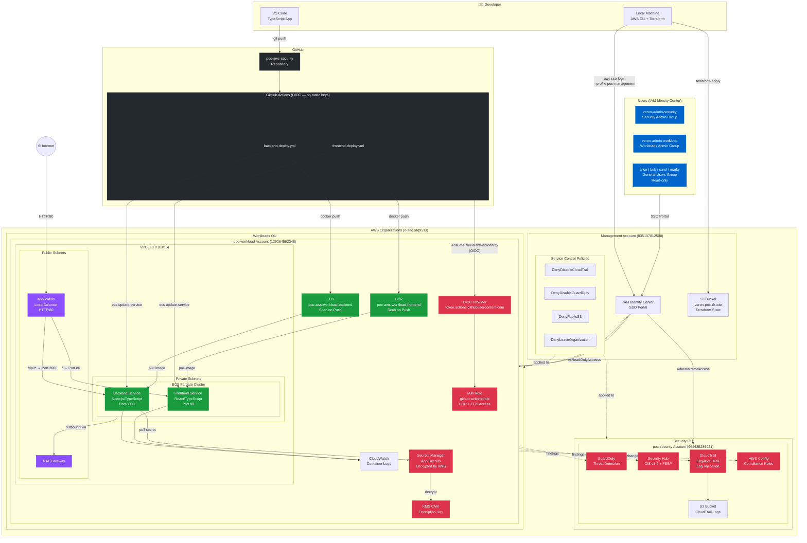

# AWS Security POC — Architecture

This document describes the end-to-end architecture of the AWS Security POC, built to demonstrate ISO 27001-aligned cloud infrastructure.

---

## Architecture Diagram



---

## Traffic Flow

```
Internet
  └── ALB (HTTP:80, public subnet)
        ├── / and /* → Frontend Service (ECS Fargate, private subnet, port 80)
        └── /api/* and /health → Backend Service (ECS Fargate, private subnet, port 3000)
                                      └── Secrets Manager (via VPC, KMS decrypt)
                                      └── CloudWatch Logs
```

---

## CI/CD Flow

```
Developer pushes to main
  └── GitHub Actions triggered (path filter: app/backend/** or app/frontend/**)
        └── OIDC token issued by GitHub
              └── AWS STS AssumeRoleWithWebIdentity
                    └── github-actions-role (ECR + ECS permissions)
                          ├── Docker build + tag with git SHA
                          ├── Push to ECR (scan on push)
                          └── ECS update-service (rolling deploy)
                                └── Wait for services-stable
```

---

## Security Monitoring Flow

```
poc-workload account
  ├── API calls → CloudTrail → S3 (log file validation)
  ├── Threats → GuardDuty → findings dashboard
  ├── Config changes → AWS Config → compliance rules evaluation
  └── All findings → Security Hub (CIS v1.4 + FSBP standards)
```

---

## Network Layout

```
VPC: 10.0.0.0/16
├── Public Subnets (ap-southeast-2a, ap-southeast-2b)
│   ├── Application Load Balancer
│   └── NAT Gateway (outbound for private subnets)
└── Private Subnets (ap-southeast-2a, ap-southeast-2b)
    └── ECS Fargate Tasks
        ├── Frontend (no public IP)
        └── Backend (no public IP)
```

---

## Account & OU Structure

```
Root (r-vlhs)
├── Security OU (ou-vlhs-jiyreru5)
│   └── poc-security (962635286921)
│       ├── GuardDuty
│       ├── Security Hub
│       ├── CloudTrail
│       └── AWS Config
└── Workloads OU (ou-vlhs-nh1mlscc)
    └── poc-workload (129264592348)
        ├── VPC + Networking
        ├── ECS Fargate Cluster
        ├── ECR Repositories
        ├── ALB
        ├── KMS + Secrets Manager
        └── GitHub Actions OIDC

Management Account (835107812500)
├── IAM Identity Center (SSO)
├── Terraform State (S3)
└── Service Control Policies → applied to both OUs
```
