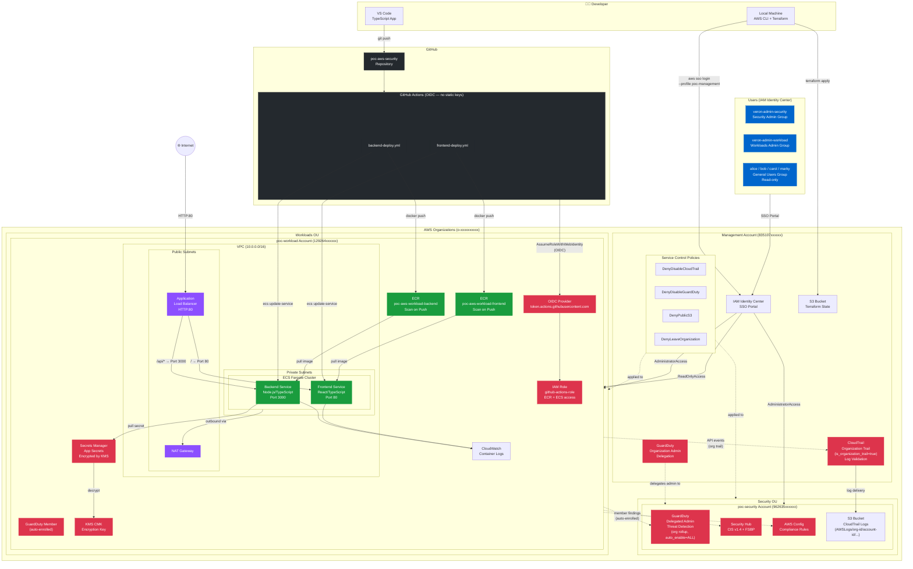

# AWS Security POC — Architecture

This document describes the end-to-end architecture of the AWS Security POC, built to demonstrate ISO 27001-aligned cloud infrastructure.

---

## Architecture Diagram



---

## Traffic Flow

```
Internet
  └── ALB (HTTP:80, public subnet)
        ├── / and /* → Frontend Service (ECS Fargate, private subnet, port 80)
        └── /api/* and /health → Backend Service (ECS Fargate, private subnet, port 3000)
                                      └── Secrets Manager (via VPC, KMS decrypt)
                                      └── CloudWatch Logs
```

---

## CI/CD Flow

```
Developer pushes to main
  └── GitHub Actions triggered (path filter: app/backend/** or app/frontend/**)
        └── OIDC token issued by GitHub
              └── AWS STS AssumeRoleWithWebIdentity
                    └── github-actions-role (ECR + ECS permissions)
                          ├── Docker build + tag with git SHA
                          ├── Push to ECR (scan on push)
                          └── ECS update-service (rolling deploy)
                                └── Wait for services-stable
```

---

## Security Monitoring Flow

CloudTrail and GuardDuty are both centralized via delegated administration, not
per-account standalone resources — every OU member account's activity rolls
up into the security account (or, for the trail itself, is delivered there).

```
Management account
  └── CloudTrail organization trail (is_organization_trail=true)
        — auto-applies to every account in every OU —
        └── log delivery → S3 bucket owned by poc-security account
  └── GuardDuty organization admin delegation → poc-security account

poc-security account (delegated admin)
  ├── GuardDuty — auto_enable_organization_members=ALL
  │     └── poc-workload (and every other OU account) auto-enrolled as a member
  │           → findings roll up here, not siloed per account
  ├── Security Hub (CIS v1.4 + FSBP standards)
  ├── AWS Config → compliance rules evaluation
  └── S3 bucket → receives CloudTrail logs from every account:
        AWSLogs/<org-id>/<account-id>/CloudTrail/...

poc-workload account
  ├── API calls → captured by the org trail → delivered to security account's S3
  ├── Threats → GuardDuty member detector (auto-managed) → findings visible in poc-security
  └── Config changes → AWS Config (security account) → compliance rules evaluation
```

---

## Network Layout

```
VPC: 10.0.0.0/16
├── Public Subnets (ap-southeast-2a, ap-southeast-2b)
│   ├── Application Load Balancer
│   └── NAT Gateway (outbound for private subnets)
└── Private Subnets (ap-southeast-2a, ap-southeast-2b)
    └── ECS Fargate Tasks
        ├── Frontend (no public IP)
        └── Backend (no public IP)
```

---

## Account & OU Structure

```
Root
├── Security OU
│   └── poc-security (962635xxxxxx) — GuardDuty delegated admin
│       ├── GuardDuty (org rollup, auto-enable=ALL)
│       ├── Security Hub
│       ├── S3 bucket — receives CloudTrail logs from every account
│       └── AWS Config
└── Workloads OU
    └── poc-workload (129264xxxxxx) — GuardDuty member (auto-enrolled)
        ├── VPC + Networking
        ├── ECS Fargate Cluster
        ├── ECR Repositories
        ├── ALB
        ├── KMS + Secrets Manager
        └── GitHub Actions OIDC

Management Account (835107xxxxxx)
├── IAM Identity Center (SSO)
├── Terraform State (S3)
├── CloudTrail organization trail (is_organization_trail=true)
├── GuardDuty organization admin delegation → poc-security
└── Service Control Policies → applied to both OUs
```

## Screenshots
